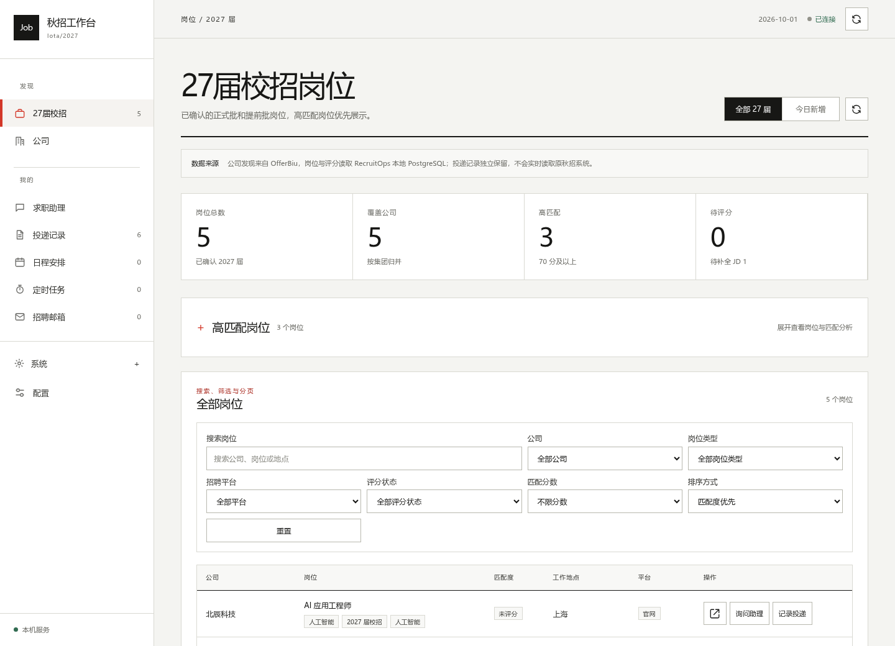
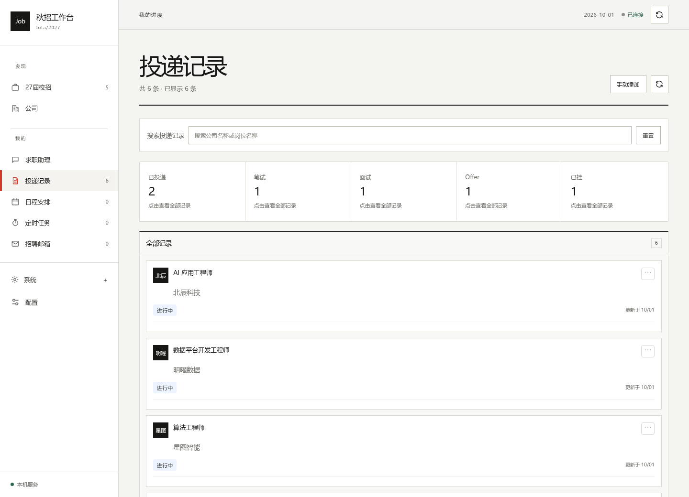
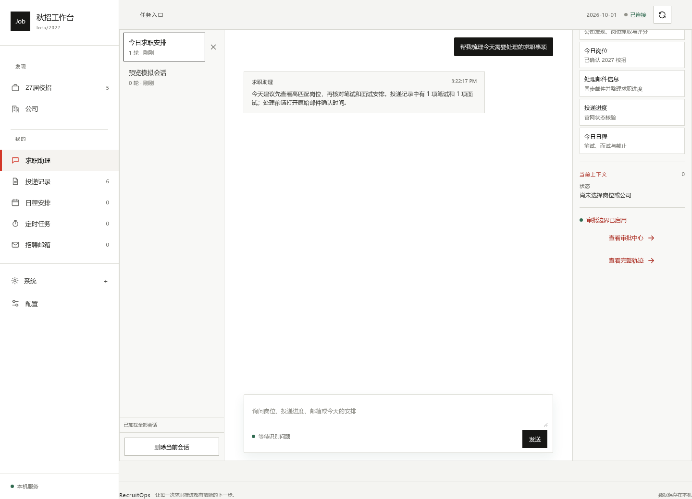
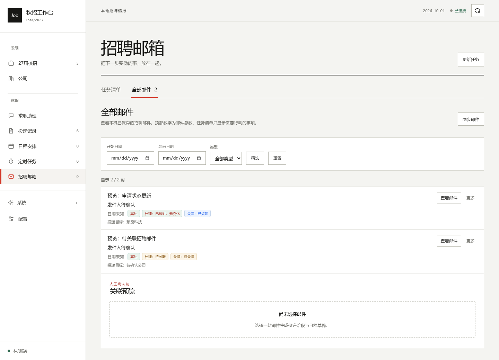

# Job · 秋招工作台

面向 2027 届校招的本地求职工作台。把岗位发现、匹配分析、投递记录、招聘邮件、日程与求职助理放在同一个界面，减少在招聘网站、邮箱和表格之间来回切换。

目前这个仓库以**源码运行**为主。项目还包含 Electron 桌面壳与内置招聘浏览器；本仓库尚未发布可直接下载的安装包，请不要使用其他仓库的 Release 作为本仓库版本。

> 下方界面图片由本项目的本地预览服务生成，使用的是模拟公司、岗位、邮件和会话，不含真实求职数据。



## 能做什么

| 模块 | 作用 |
| --- | --- |
| 27 届校招 | 汇总公司官网岗位，按关键词、地区、公司和匹配度查看候选岗位 |
| 公司 | 查看招聘入口、抓取状态和岗位数量，排查未完成的来源 |
| 求职助理 | 用自然语言查询岗位、投递进度、招聘邮件和今日安排；可调用受控工具执行任务 |
| 投递记录 | 保存岗位与阶段历史，查看已投递、笔试、面试、Offer 等进度 |
| 招聘邮箱 | 通过 IMAP 同步并整理招聘邮件，识别测评、笔试和面试等事项 |
| 日程安排 | 把有明确时间的事项加入日程，保留待确认的待办 |
| 定时任务 | 管理岗位抓取、评分、邮箱处理和进度复核等本地任务 |
| 配置 | 设置模型连接、简历分析、岗位筛选范围和邮箱连接 |

所有业务记录使用结构化存储；模型负责理解、分析和工具调用。涉及官网登录、验证码以及最终投递提交的步骤由用户在浏览器中完成。

## 界面预览

<table>
  <tr>
    <td width="50%"><br>投递记录</td>
    <td width="50%"><br>求职助理</td>
  </tr>
  <tr>
    <td width="50%"><br>招聘邮箱</td>
    <td width="50%">界面采用极简主义与瑞士风格，主要面向桌面浏览器使用。截图中的内容均为模拟数据。</td>
  </tr>
</table>

## 快速开始

需要 Git 和 Docker Desktop。克隆本仓库后，复制示例配置并启动服务：

```bash
git clone https://github.com/zzx666-code/recruitops-agent.git
cd recruitops-agent
cp .env.example .env
cp config/companies.example.yaml config/companies.yaml
cp config/candidate_profile.example.yaml config/candidate_profile.yaml
docker compose up -d --build
```

在 Windows PowerShell 中，`cp` 可直接使用，也可以写成 `Copy-Item`。启动后打开 <http://127.0.0.1:8010/>；服务就绪状态可在 <http://127.0.0.1:8010/ready> 查看。停止服务使用 `docker compose down`。初次启动会创建数据库，通常需要等待片刻。

刚启动时没有岗位和投递记录是正常的。进入 **配置** 设置模型连接、简历与岗位关键词，随后运行岗位抓取和匹配流程。招聘邮箱是可选功能，需要单独填写 IMAP 授权码。求职助理依赖可用的模型连接；模型未配置时，其他本地页面仍可使用。

### 建议的使用顺序

1. 在 **配置** 中测试并保存模型连接，上传文字版简历，检查岗位关键词与行业范围。
2. 在 **求职助理** 发起岗位抓取与评分，或在 **定时任务** 中安排定期执行。
3. 到 **27 届校招** 查看高匹配岗位，并在招聘官网完成实际投递。
4. 在 **投递记录** 保存投递结果；按需连接 **招聘邮箱** 并核对 **日程安排**。

模型调用和邮箱连接需要各自服务可用；抓取结果取决于招聘网站的实际页面与访问条件。默认全局写入能力关闭，某些本机页面操作需要对应的局部开关；详见下方配置说明。

## 本地数据与配置

- `.env` 是本机运行配置，包含服务开关与连接参数；不要提交 API Key、邮箱授权码或个人信息。
- `config/companies.yaml` 与 `config/candidate_profile.yaml` 从示例文件创建，供本地来源和候选人配置使用。
- 运行数据保存在本地数据库和 `.data/` 等运行目录。Docker 的数据库和服务状态使用命名卷；备份或迁移前请先停止服务并核对卷与目录。
- 简历、邮件正文、浏览器资料、数据库和备份都不应上传到公开仓库。

默认 `.env.example` 中 `RECRUITOPS_WRITE_ENABLED=false`。本机手动导入投递记录可使用 `RECRUITOPS_LOCAL_APPLICATION_IMPORT_ENABLED=true`；本机招聘邮件整理可使用 `RECRUITOPS_LOCAL_MAIL_TASKS_ENABLED=true`。这些开关只开放各自的局部功能，不代表放开所有写入。更多部署与数据迁移信息见[安装说明](docs/INSTALLATION.md)和[已有数据升级说明](docs/UPGRADE_EXISTING_DATA.md)。

## 开发与检查

项目主要使用 FastAPI、原生 Web 页面、PostgreSQL、Playwright 和 Electron。代码目录如下：

```text
apps/                 API、Web 工作台和桌面壳
packages/             领域、存储、抓取、匹配、邮件与 Agent 运行模块
migrations/           PostgreSQL 迁移
config/               本地配置示例
.agents/skills/       求职助理领域技能
scripts/              启动、诊断、备份及发布辅助脚本
tests/、evals/        测试与评估
docs/                 安装、架构和故障排查文档
```

本地开发和基础检查：

```bash
pip install -e ".[dev]"
playwright install chromium
python -m pytest -c pytest-public.ini
python -m compileall apps packages evals scripts
python scripts/check_migrations.py
docker compose config
```

README 图片可通过 `scripts/capture_readme_screenshots.py` 重建。它连接项目的纯模拟预览服务，不读取本机数据库；运行时需要 Playwright 和 Chromium。提交图片前仍应目视确认内容。

## 文档

- [安装与部署](docs/INSTALLATION.md)
- [启动指南](docs/STARTUP_GUIDE.md)
- [系统架构](docs/ARCHITECTURE.md)
- [抓取流程](docs/crawling_process.md)
- [MCP 工具](docs/MCP.md)
- [故障排查](docs/TROUBLESHOOTING.md)
- [安全说明](SECURITY.md)
- [贡献指南](CONTRIBUTING.md)

## 来源与许可

本项目基于[原 RecruitOps 项目](https://github.com/849879772/recruitops-agent)继续开发，保留原有开源许可及第三方组件声明。代码按 [MIT License](LICENSE) 发布；相关组件声明见 `packages/desktop_browser/NOTICE` 和 `packages/desktop_filler/NOTICE`。
